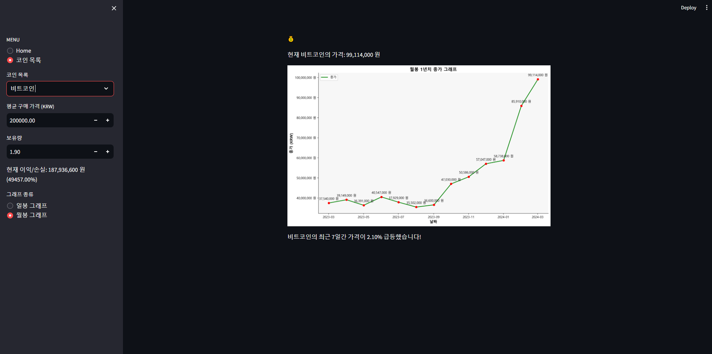

# 업비트 개발 API를 이용하여, 코인시장 동향과 추세를 알려주는 대시보드

이 프로젝트는 한국 시장의 코인 시세를 실시간으로 모티너링하고, 일봉 및 월봉 차트를 제공하는 웹입니다. 👀

---
# 주요 기능

1. 실시간 업데이트: 업비트 API를 통해 코인 가격을 실시간으로 가져와 보여줍니다.
2. 일봉 및 월봉 차트: 선택한 코인의 일봉 및 월봉 차트를 통해 가격 추이를 파악할 수 있습니다.
3. 이익/손실 계산: 사용자가 입력한 평균 구매 가격과 보유량을 바탕으로 현재 이익 또는 손실을 계산하고 보여줍니다.
4. 가격 변동 알림: 최근 7일간의 종가를 기반으로 가격이 급등하거나 급락한 코인에 대한 알림을 보여줍니다. 📈📉

---

# 기술 스택
Python: 주요 백엔드 및 데이터 처리 언어로 사용되었습니다.
Streamlit: 웹 앱 프레임워크로 사용되어 사용자 인터페이스를 구축했습니다.
Matplotlib, Pandas: 가격 차트 및 그래프를 생성하기 위해 사용되었습니다.
Requests: 업비트 API와 통신하기 위해 사용되었습니다.

---
# 사용법
1. 좌측 사이드바에서 "코인 목록"을 선택하여 코인을 선택합니다.
2.선택한 코인에 대한 실시간 가격과 차트가 표시됩니다.
필요에 따라 평균 구매 가격과 보유량을 입력하고 현재 이익/손실을 확인합니다.
원하는 차트를 선택하여 일봉 또는 월봉 차트를 확인합니다.
가격 변동 알림을 통해 최근 7일간의 가격 변동을 확인합니다.

# 코드 설명
1. 업비트 API 사용
get_prices(market): 업비트 API를 통해 특정 코인의 실시간 가격을 가져옵니다.
create_coin_map(): 업비트 API를 사용하여 코인의 한글 이름과 식별자를 매핑하는 딕셔너리를 생성합니다.
2. 캔들 데이터 가져오기
get_days_candles(market): 특정 코인의 일주일치 일봉 캔들 데이터를 가져옵니다.
get_monthly_candles(market): 특정 코인의 일년간 월봉 캔들 데이터를 가져옵니다.
3. 홈 화면 및 코인 선택 기능
show_homepage_description(): 홈 화면 설명을 보여줍니다.
selected_sidebar: 왼쪽 사이드바에서 "Home" 또는 "코인 목록"을 선택합니다.
4. 코인 정보 및 그래프 표시
selected_ticker: 사용자가 선택한 코인 이름을 가져옵니다.
average_purchase_price, amount_held: 사용자가 입력한 평균 구매 가격과 보유량을 가져옵니다.
days_candles: 선택한 코인의 일봉 데이터를 가져옵니다.
plot_type: 사용자가 선택한 그래프 종류를 가져옵니다.
5. 그래프 그리기 및 가격 변동 알림
alert_price_changes(close_prices): 최근 7일간의 종가를 기반으로 가격 변동에 대한 알림을 보여줍니다. 