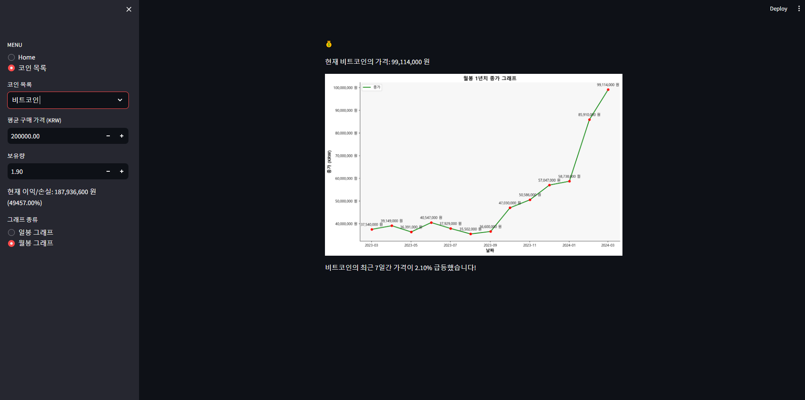

# 📈 업비트 개발 API를 이용하여, 코인시장 동향과 추세를 알려주는 대시보드
- 실행방법 : `streamlit run main.py`

---

## 🚀 주요 기능
- 업비트 API 기반 실시간 코인 시세 조회
- 선택한 코인의 일봉·월봉 차트 시각화
- 평균 구매 가격 및 보유량 기반 손익 계산
- 최근 7일 종가 기준 급등·급락 코인 알림

---

## 🛠 기술 스택
- Python
- Streamlit
- Matplotlib, Pandas
- Requests

---

## 📌 사용법
- 좌측 사이드바에서 "코인 목록" 선택하여 원하는 코인 선택
- 선택한 코인의 실시간 가격 및 차트 확인
- 평균 구매 가격과 보유량 입력 후 현재 손익 확인
- 원하는 차트 (일봉 혹은 월봉) 선택 후 가격 추이 확인
- 가격 변동 알림을 통해 최근 7일간 변동 내역 확인

## 🔍 코드 설명

### 1. 업비트 API 사용
- `get_prices(market)`: 특정 코인 실시간 가격 조회
- `create_coin_map()`: 코인 한글 이름·식별자 매핑 딕셔너리 생성

### 2. 캔들 데이터 조회
- `get_days_candles(market)`: 특정 코인 일주일치 일봉 캔들 데이터 조회
- `get_monthly_candles(market)`: 특정 코인 일년간 월봉 캔들 데이터 조회

### 3. 홈 화면 및 코인 선택
- `show_homepage_description()`: 홈 화면 설명 표시
- `selected_sidebar`: 좌측 사이드바에서 Home 또는 코인 목록 선택

### 4. 코인 정보 및 그래프 표시
- `selected_ticker`: 사용자 선택 코인 이름 조회
- `average_purchase_price, amount_held`: 평균 구매 가격·보유량 입력값 조회
- `days_candles`: 선택 코인 일봉 데이터 조회
- `plot_type`: 사용자 선택 그래프 종류 조회

### 5. 그래프 및 가격 변동 알림
- `alert_price_changes(close_prices)`: 최근 7일 종가 기반 가격 변동 알림 표시
